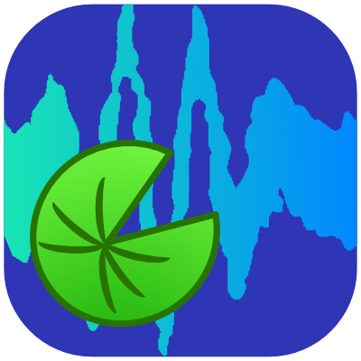

<p align="center">
  
</p>

<h1 align="center">Lillypad</h1>

<p align="center">
  A FROG acquisition app for ultrashort-pulse characterisation —
  motorised delay stage control + spectrometer live feed in a Qt GUI.
</p>

---
## Features

- **Live spectrum feed** on a background thread, paced to the spectrometer's
  integration time, with blitted redraws so the UI stays responsive during long
  integrations.
- **Live FROG build-up** — the trace and its autocorrelation are drawn column by
  column as the scan runs, each costing one small blit rather than a full redraw.
- **Hardware abstraction** — the GUI never imports a vendor SDK. Thorlabs
  Kinesis, Zaber and Ocean Optics adapters all sit behind two abstract base
  classes, and vendor libraries are imported lazily.
- **Simulator with nine pulse shapes** — transform-limited sech²/Gaussian, GDD
  chirp, third-order dispersion, self-phase modulation, split-step fibre
  output, double pulse, two-colour pair, and a deliberately over-exposed pulse
  for exercising the saturation alarm.
- **Saturation detection** — per-column clipped-pixel counts, a status lamp, and
  an optional abort. Whether a scan *could* be checked at all is recorded
  separately from whether it *was* clean.
- **Bracketed background** — dark frames captured before and after the scan,
  stored alongside the trace rather than silently subtracted.
- **Three export formats** — `.dwc` FROG trace, `.npz` archive (raw counts,
  backgrounds, saturation record, full metadata), and a spreadsheet `.csv`.
- **Light and dark themes**, log/linear spectrum, manual or auto axis limits,
  and an interactive colour scale for the trace.

## Layout

| File | Role |
| --- | --- |
| [frog_gui_fast.py](frog_gui_fast.py) | PySide6 GUI — application entry point |
| [hardware.py](hardware.py) | Device abstraction: stage + spectrometer adapters, pulse simulator |
| [scan.py](scan.py) | Delay-scan engine: optics conversions, scan worker, file writers |
| [Lillypad.spec](Lillypad.spec) | PyInstaller recipe for a standalone Windows build |
| [requirements.txt](requirements.txt) | Pinned lockfile (Python 3.13) — install with `--no-deps` |
| [icons/](icons/) | Application and toolbar icons |

The dependency direction is strictly one-way — `frog_gui_fast` → `scan` →
`hardware` — and `hardware.py` has no Qt dependency at all. `scan.py` is split
into a Qt-free core (conversions, dataclasses, autocorrelation, writers) and a
thin `FrogScanWorker(QThread)` on top of it, so the analysis half is unit-testable
and reusable without a GUI.

## Getting started

Requires Python 3.13.  

Requires Visual C++ - e.g. x64 "Visual C++ Redistributable" (vc_redist.x64.exe)  

(likely) Requires Kinesis to be installed for Thorlabs stages to get the drivers  


!!! Important: if Python is installed through Anaconda it will give you an error "DLL load failed..." because it carries its own DLLs / search behaviour. If python is not installed otherwise, install the latests version and make sure you deactivate conda in your terminal if it starts up with it.

```bash
git clone https://github.com/Daniel-F-QM/lillypad.git
cd lillypad

conda deactivate                #only if your terminal launched with conda, you will see (Base)... in your terminal
python -m venv .venv
.venv\Scripts\activate          # Windows;  source .venv/bin/activate on POSIX
pip install --no-deps -r requirements.txt
seabreeze_os_setup              # Required for seabreeze to talk to the spectrometers

python frog_gui_fast.py
```

> **`--no-deps` is required.** `requirements.txt` is a complete lockfile, and
> the flag is what keeps **PyQt5** out. `pylablib` hard-declares `pyqt5` even
> though Lillypad is PySide6-only and only uses `pylablib.devices` — a plain
> `pip install -r` puts two Qt bindings in the environment, which has broken
> PyInstaller builds here before. `pip check` will warn that pylablib is
> missing pyqt5; that warning is expected and safe to ignore.

The app starts on simulated hardware, so this works with nothing plugged in.
Press **START FEED** for a live spectrum, then **Measure FROG** to run a scan.
Pick a pulse shape under **Hardware** to change what the simulator produces.

### Self-tests

Both non-GUI modules are runnable and check themselves — no hardware, no Qt:

```bash
python hardware.py    # simulator self-test
python scan.py        # pure-core self-test (delay grid, conversions, autocorrelation)
```

## Real hardware

Open the **Hardware** dialog and pick a device. Vendor libraries load only when
you actually select their device, so a missing SDK costs you that one adapter
rather than the whole app.

| Device | Adapter | Backend |
| --- | --- | --- |
| Thorlabs Kinesis stage (LTS300C/M + autodetected stages) | `KinesisStage` | `pylablib` |
| Zaber stage (serial / daisy-chain) | `ZaberStage` | `zaber-motion` |
| piezosystems Jena piezo stage (serial, 320 um closed loop) | `PiezoJenaStage` | `pyserial` |
| Ocean Optics / Ocean Insight spectrometer | `SeabreezeSpectrometer` | `seabreeze` |

Kinesis and Seabreeze both enumerate first and pop a picker when more than one
device is attached. Zaber and Piezo Jena auto-scan serial ports when no port is
given.

**Spectrometer backends.** python-seabreeze has two backends and the
**Backend** box in the Hardware dialog switches between them (applied on the
next connect). The default is **pyseabreeze**, the pure-Python backend — it is
the only one that supports the newer Ocean Insight models (SR/ST/HDX series).
**cseabreeze**, the vendor C library, remains selectable for older devices
that misbehave through pyseabreeze. pyseabreeze talks USB through `pyusb`,
which needs a libusb driver: the `libusb-package` wheel in
`requirements.txt` provides the DLL on Windows (Lillypad puts it on `PATH`
automatically), and the device itself must be bound to a WinUSB/libusb
driver — `seabreeze_os_setup` (above) installs Ocean's drivers; if the device
still does not enumerate, bind its USB interface to **WinUSB** with
[Zadig](https://zadig.akeo.ie/).

**Kinesis stages.** `KinesisStage` identifies the stage from the model number
its controller reports before driving it, and calibrates it either from a
`STAGE_CONFIGS` entry in [hardware.py](hardware.py) (needed for the LTS300C/M,
which pylablib cannot calibrate itself) or from pylablib's own stage
autodetection (the Z6xx/Z7xx/Z8xx and MTS families, K10CR1, …). The resulting
scale units are then verified, so a rotational or uncalibrated stage is
*refused* rather than driven with somebody else's steps-per-mm — a wrong scale
would silently distort the delay axis instead of failing. To support a stage
that matches neither, add a `STAGE_CONFIGS` entry.

**Spectrometer calibration.** The toolbar's **Calibration** menu assigns an
intensity calibration to each connected spectrometer: a two-column text file
(wavelength in nm, multiplicative factor; `#` comments allowed) from the
`calibration_files/` folder next to the program (next to the `.exe` for the
frozen build — the folder is user-editable, drop new files in or use *Add new
calibration…* in the menu). The factors are interpolated onto the device's
pixel grid and multiply every displayed and recorded spectrum. Saturation is
always judged on **raw** ADC counts, before calibration.

**Multi-spectrometer mode.** *Enable multi-spectrometer mode* in the
toolbar's **Multi-Spec** menu opens two slots, each with its own spectrometer
and calibration submenu; once both slots are filled the pair connects
automatically as one stitched device (`StitchedSpectrometer`): spectra are
interpolated onto a common grid, each device's own calibration file is
applied first, and the two are averaged across the overlap (the ranges must
overlap). *Auto-stitch* least-squares-matches the bluer spectrometer to the
redder one over the overlap (do this with light spanning the overlap);
*Manual stitch…* enters the factor by hand. Entering the mode adds a second
saturation lamp to the status bar: each device's RAW frames are judged
against that device's own full scale, both live and during scans, so either
detector clipping trips its own alarm. *Disable multi-spectrometer mode*
keeps the slot-1 spectrometer connected as a normal single device.

**Adding a device class.** Implement `StageBase` or `SpectrometerBase` in
[hardware.py](hardware.py). Moves must block until settled, so the scan loop can
read back a trustworthy position on the next line.

## Unit conventions

These are load-bearing — mixing them up produces a plausible-looking trace with a
wrong time axis.

- **Delay: femtoseconds.** The master unit for the FROG axis.
- **Positions: micrometres** everywhere user-facing and throughout `scan.py`.
- **Stage adapters: millimetres.** `pylablib` reports the LTS300 in mm, so that
  boundary is isolated in `_um_to_stage` / `_stage_to_um` — the only two places
  mm appears. Make them identity if an adapter is ever changed to report µm.
- **Wavelength: nanometres**; spectra are **raw counts**.

Delay and position assume a double-pass geometry, otherwise adjust `pass_factor`.

## Building a standalone executable

```bash
pyinstaller Lillypad.spec
```

Produces `dist/Lillypad/Lillypad.exe` with the icons bundled. `resource_path()`
in the GUI resolves assets through `sys._MEIPASS`, so the same code path works
frozen and from source.

The spec excludes `PyQt5`, `PyQt6` and `PySide2`, so a stray Qt binding in the
environment cannot end up in the bundle even if something reinstalls one.
